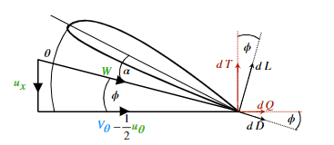
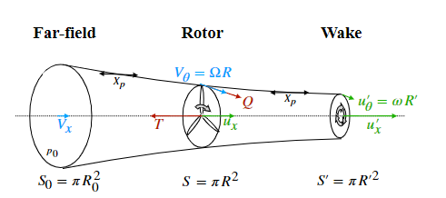
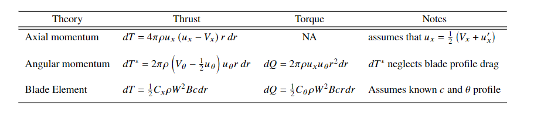
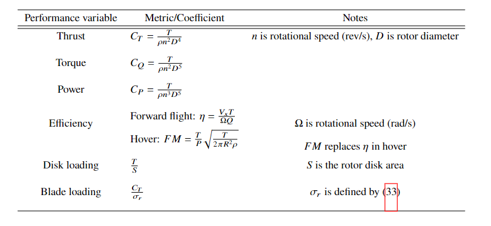
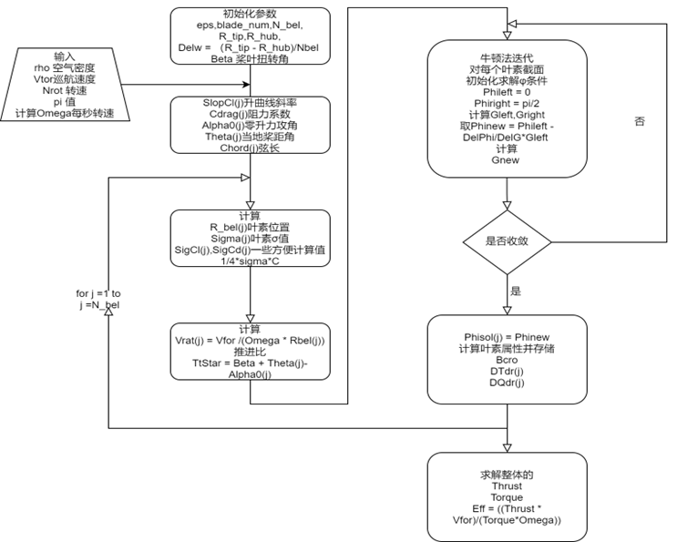
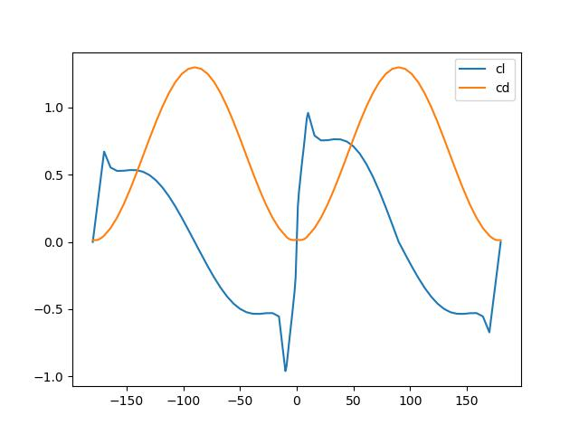

# 第二章 三维螺旋桨气动性能与优化（*）评估
**王晨宇**

## 2.1 BEM原理

经典BEM理论的完全推导由Glauert在1935年完成，详见
Glauert, H., “Airplane propellers,” Aerodynamic theory, Springer, 1935, pp. 169–360

### 2.1.1 参数设置
来流系数包括轴向和径向。几何参数描述了旋翼和流管几何结构。性能参数表示测量旋翼性能的指标。下标0是远场，上标是气流尾迹参数。

| Flow variables  | Geometric variables   | Performance parameters   |
|-------------- | -------------- | -------------- |
|   $V_x$ 轴自由流速度  | R 转子半径     | T, $C_T$ 推力，推力系数     |
|   $u_x$ 盘上轴诱导速度 | r 径向距离  | Q,$C_Q$ 扭矩，扭矩系数|
| $u'_x$ 尾流轴向诱导速度 | $S_0$ 上游流管面积 | P,$C_P$ 动力(power)，动力系数 |
| $V_\theta$ 周向转子速度 | S 转子扫掠面积 | J 推进比|
| $u_\theta$ 盘上周向诱导速度 | $S'$ 尾流流管面积 | $\eta$ 总效率|
| $u'_\theta$ 尾流周向诱导速度 | $\theta$ 扭转角 | $\eta_1$ 轴向效率|
| W 入流速度和矢量| $\alpha$ 攻角 | $\eta_2$ 周向效率|
| $\Omega$ 周向角速度 | $\phi$ 入流角 | $\eta_3$ 轮廓(profile) 阻力效率|
| $\omega$ 周向尾流速度 | $c$ 弦长 | FM 品质因子|
| $a_x$ 轴向诱导因子 | $\sigma$ 叶片刚度 | $C_r/\sigma$ 叶片负载系数 |
|$a_\sigma$ 切向诱导系数|||

### 2.1.2 动量理论

- 分析通过转子平面气流动量的改变量。规定控制面“流管”
- 不考虑旋翼几何，只考虑动量通量

#### 2.1.2.1 轴向动量平衡

对于轴向动量，上游初始速度 $V_x$, 进入流管，转子面加速到轴向速度 $u_x$ ，最终尾流速度 $u'_x$

考虑牛顿第二定律：

$$\begin{equation} T = \dot{m_{air}}(u'_x - V_x ) =  \rho u_x S ( u'_x - V_x)   \end{equation}  $$

忽略体力，考虑质量通量在面上的积分

$$\begin{equation}T - X_p + \rho (S_0 - S' ) = \int 2 \pi \rho u_x (u'_x -V_x)r dr  \end{equation} $$

r代表径向距离，$p_0 (S_0 - S') $是作用流管两端压力， $X_p$是侧向压力。两项抵消，有

$$\begin{equation} T = \int 2 \pi \rho u_x (u'_x - V_x) r dr \end{equation}  $$

但是不可以转化为微分： $dT = 2\pi \rho u_x (u'_x  -V_x) r dr $ ,这是由于微分形式需要保证微元间无相互作用

化简未知量下游尾迹速度 $u'_x$,单位时间流管做工由公式(1) 

$$\begin{equation} P = \frac{1}{2} \dot{m_{air} }  (u'_x -V^2_x) = \frac{1}{2} \dot{m_{air}}(u'x+V_x) = \frac{1}{2}(u'_x + V_x)T \end{equation}$$

忽略了旋转诱导的滑流移动

单位时刻做的有用功即4功率

$$\begin{equation}  \dot{W_T} = T u_x \end{equation} $$

假设转子面轴向速度为远场上游与尾流速度平均

$$ \begin{equation} u_x = \frac{1}{2 }(u'_x +V_x) \end{equation}$$

或者通常用的归一化诱导因子 $a_x$

$$\begin{equation} u_x = V_x (1 + a_x) \end{equation}$$

由上述两式，有转化

$$\begin{equation}  dT = 4 \pi \rho u_x (u_x - V_x) r dr\end{equation} $$
或

$$\begin{equation}  dT = 4 \pi \rho V^2_x (1 +a_x) a_x r dr \end{equation}$$

但是公式(9)不可以在0表示来流速度，此时 $a_x$ 无定义

定义效率
$$ \begin{equation} \eta = \frac{P_{out}}{P_{in}} \end{equation}$$

输出功率是远场流动速度乘推力（无旋转动力损失情况）。考虑轴向损失下，有

$$\begin{equation} \eta_1 = \frac{V_x T}{P} = \frac{V_x}{u_x}\end{equation}$$

#### 2.1.2.2 转向动量理论

- 考虑螺旋桨滑流旋转损失（之前忽略）。由于桨叶与空气分子相互作用，增加了转向动量。
- 点质量假设，有角动量 $L = u_\theta m r^2$ 也可以写为 $ L = \omega_\theta m r^2 $

由角动量守恒，导出切向诱导速度与最终尾流速度

$$\begin{equation}  u_\theta r^2 = u'_\theta r'^2 \end{equation}$$

$$ \begin{equation} dQ = \dot{m} \omega_\theta r^2 = 2 \pi \rho \omega_\theta u_x r^3 dr = 2 \pi \rho u_\theta u_x r^2 dr\end{equation} $$

而扭矩是由角动量单位时间增长导致的

$$\begin{equation} dQ = \dot{m} u_\theta r^2 = 2 \pi \rho u_x u_\theta r^2 dr\end{equation} $$

定义切向诱导系数 $a_\theta = \frac{u_\theta}{2 V_\theta} $, 公式(14)改写为

$$ \begin{equation}dQ = 4 \pi \rho V_x V_\theta (1+a_x) a_\theta r^2 dr \end{equation}$$

在转子面前后用不可压缩无黏伯努利方程，通过转子平面的压强变化为

$$\begin{equation}\delta p = \rho \frac{1}{2}(V_\theta + (V_\theta - u_\theta))(V_\theta - (V_\theta - u_\theta))  = \rho (V_\theta - \frac{1}{2} u_\theta)u_\theta \end{equation}$$

进一步在周向面元上由无黏不可压缩假定，有

$$\begin{equation}dT^* = 2 \pi \delta p dr = 2 \pi \rho (V_\theta -  \frac{1}{2} u_\theta)u_\theta r dr  = 2 \pi \rho (\Omega r -\frac{1}{2} \omega_\theta r) \omega_\theta r^2 dr\end{equation} $$

对单位时间扭矩做功（输入），单位时间推力做工（输出）积分，有

$$\begin{equation} T^* = \int 2 \pi \rho (\Omega r - \frac{1}{2} \omega_\theta r )\omega_\theta r^2 dr = \frac{1}{4} 2 \pi \rho(\Omega R - \frac{1}{2} \omega_\theta R )\omega_\theta R^3  \end{equation}$$

$$ \begin{equation}Q = \int 2 \pi \rho \omega_\theta u_x r^3 dr = 2 \pi \rho \omega_\theta u_x r^3 \frac{R^4}{4} = \frac{R^4}{4} 2 \pi \rho u_x u_\theta \end{equation}$$

代入公式(17)得到
$$\begin{equation}\eta_1 \eta_2 = \frac{V_x T^*}{\Omega Q} = \frac{V_x \pi \rho (V_\theta - u_\theta)u_\theta R^2}{\Omega \pi \rho u_x u_{\theta} R^3} = \frac{V_x (V_\theta - \frac{1}{2}u_\theta)}{u_x V_\theta} \end{equation}$$

对比效率公式(11)可以得到转动诱导效率
$$\begin{equation}\eta_2 = \frac{V_\theta - \frac{1}{2}u_\theta}{V_\theta} \end{equation}$$

### 2.1.3 叶素动量理论

- 对于低保真（low-fidelity）转子模型可用，考虑转子几何形状。每个叶片是个二维薄翼
- 表现在叶素翼型上的升力阻力，依赖来流速度W，雷诺数，和攻角 $\alpha $

#### 2.1.3.1 叶素理论

每个叶素翼型上的推力扭力表示为

$$\begin{equation}dT = dL \cos \phi - dD \sin \phi\end{equation} $$

$$\begin{equation}dQ = dL \sin \phi + dD \cos \phi\end{equation}$$

升阻力系数表示为

$$\begin{equation}dL = \frac{1}{2} \rho W^2 C_l c dr\end{equation} $$

$$\begin{equation}dD = \frac{1}{2} \rho W^2 C_d c dr\end{equation} $$

W 为 $ W = \sqrt{u^2_x + (V_\theta - \frac{1}{2} u_\theta)^2 }$

轴向$u_x 看作 V_x$周向诱导速度为0。

#### 2.1.3.2 叶素动量理论

B为机翼数量，当推力(22)与扭力(23)相等时

$$\begin{equation}4 \pi \rho u_x (u_x - V_x) r dr = dT = \frac{1}{2} C_\theta \rho W^2 B c r dr \end{equation}$$

$$\begin{equation} 2 \pi \rho u_x u_\theta r^2 dr = \frac{1}{2} C_\theta \rho W^2 B c r dr\end{equation}$$

积分有

$$ \begin{equation}4 \pi \rho u_x( u_x - V_x)r = \frac{1}{2}(\cos \phi C_l - \sin \phi C_d)(u^2_x + (V_\theta - \frac{1}{2} u_\theta)^2)BC \end{equation}$$

$$\begin{equation} 2 \pi \rho u_x u_\theta r = \frac{1}{2} (\sin \phi C_l + \cos \phi C_d)(u^2_x + (V_\theta - \frac{1}{2})^2)BC)\end{equation} $$
定义刚度 $ \sigma = \frac{Bc}{2 \pi r}$，对于整个旋翼 $\sigma_r = \frac{B \int ^ R_0 c(r)dr }{\pi R^2} $ 化简有
$$\begin{equation} 2 u_x (u_x - V_x) = \frac{1}{2}(\cos \phi C_l - \sin \phi C_d)(u^2_x + (V_\theta - \frac{1}{2} u_\theta)^2)\sigma\end{equation} $$
$$\begin{equation}u_x u_\theta = \frac{1}{2} (\sin \phi C_l + \cos \phi C_d)(u^2_x + (V_\theta - \frac{1}{2})^2) \sigma\end{equation} $$

由公式(30)(31)得到速度分量

$$\begin{equation}u_\theta = \frac{2 \sigma C_\theta V_\theta}{4 \sin \phi \cos \phi + \sigma C_\theta} \end{equation} $$

$$\begin{equation} u_x = V_x + \frac{\sigma C_x V_\theta}{4 \sin \phi \cos \phi + \sigma C_\theta} \end{equation}  $$

将无量纲数 $a_x 和 a_\theta $ 代入公式(33)(34)

$$ \begin{equation}a_x = \frac{C_x \sigma}{4 \sin^2 \phi - C_x \sigma} \end{equation} $$
$$ \begin{equation}a_\theta = \frac{C_\theta \sigma}{2 \sin 2 \phi + C_\theta \sigma}\end{equation}   $$

引入入流角$\theta$

$$ \begin{equation}tan \phi = \frac{u_x}{V_\theta - \frac{1}{2 }u_\theta} \end{equation} $$

公式(32)(33)代入(36),已知推进比J定义为 $ J = \frac{V_\infty}{n D_p} = \frac{\pi V_x}{\pi n R} = \pi \frac{V_x}{V_\theta} $

得到

$$ \begin{equation} tan \phi = \frac{V_x + \frac{\sigma C_x V_\theta}{4 \sin \phi \cos \phi + \sigma C_\theta} }{V_\theta - \frac{ \sigma C_\theta V_\theta}{4 \sin \phi \cos \phi + \sigma C_\theta}} = \frac{(4 \sin \phi \cos \phi + \sigma C_\theta)V_x + \sigma C_x V_\theta}{4 \sin \phi \cos \phi V_\theta}\end{equation} $$

最终化简(37)得到残差迭代式

$$ \begin{equation} R(\phi) = \frac{J}{\pi}(\sigma C_\theta + 4 \phi \cos \phi )+ ( \sigma C_x - 4 \sin^2 \phi)\end{equation} $$

在公式(38)中，各参数均为弦长 $c$和扭转角 $\theta$ 的函数，迭代可以得到入流角 $\phi$ 值，可以通过二分法求解此式的根，Ning在

 Ning, S. A., “A simple solution method for the blade element momentum equations with guaranteed convergence,” Wind Energy, Vol. 17, No. 9, 2014, pp. 1327–1345.
Ning, A., “Using blade element momentum methods with gradient-based design optimization,” Structural and Multidisciplinary Optimization, 2021, pp. 1–24

两文中探索了收敛条件，用二分法找根时

if $ \phi = 0 , C_x = C_l , C_\theta = C_d $ and $\theta = \alpha$ ，可以化简公式(38)为

$$ \begin{equation} R(0) = \sigma C_d (\frac{J}{\pi} + \frac{C_l}{C_d}) \end{equation}$$

if $ \phi = \frac{\pi}{2} , C_x = -C_d , C_\theta = C_l $ and $\alpha = \theta - \frac{\pi}{2} $ ，化简公式(38)为

$$ \begin{equation} R(\frac{\pi}{2}) = \sigma(\frac{J}{\pi} C_l - C_d) - 4\end{equation} $$

如果两点异号，满足

$$ \begin{equation}C_l(\theta) > 0 \end{equation}$$
$$ \begin{equation}C_l(\theta - \frac{\pi}{2})<0\end{equation} $$

公式(41)在对称和正弯度翼型成立，而对于公式(42),在极少数 $\theta$ 接近 $\frac{\pi}{2}$ 情况 $\alpha$ 为较大的负值，$C_l$ 为0,公式(42)才失效，可以认为BEMT在绝大多数情况有解。

**附表**：

叶素动量理论总结

转子表现系数总结

程序计算流程

**注**：
本节流程来自Marius L.Ruh and John T.Hwang，具体推导详询 WCYaerospace@sjtu.edu.cn

Marius L.Ruh , John T.Hwang,"Robust modeling and optimal design of rotors using blade element momentum theory" AIAA,2021,pp.1-8.

进一步BEM修正推荐阅读报告

Winarto, Hadi. "BEMT algorithm for the prediction of the performance of arbitrary propellers." Melbourne: The Sir Lawrence Wackett Centre for Aerospace Design Technology, Royal Melbourne Institute of Technology,2004.

## 2.2 基于BEMT的旋翼性能评估

本节为介绍根据python程序实现BEMT的简易计算，配置环境与所需程序见`resource1`文件夹，操作语句默认在此文件夹路径下进行。

### 2.2.1 给定翼型输出曲线
由于使用BEM需要360°全角外推 $C_l - \alpha$ 与 $C_d - \alpha $ 数据，本小节完成了根据翼型文件或naca四字翼型名称快速生成外推曲线功能

### 2.2.1.1 基础用法

**使用方法**：

如果输入naca翼型
`python extrapolate --foil 'naca4412' --Re 1e5 --base_angle '-10 10'  --save_file 'example_extrapolate'`

如果输入翼型文件
`python extrapolate --foil 'example_extrapolate/ara_d_20.dat'  --Re 1e5 --base_angle '-10 10' --save_file 'example_extrapolate'`

翼型文件格式参照`example_extrapolate/ara_d_20.dat`

**参数说明**：

|输入参数| 说明|
|----|----|
|foil|输入为naca翼型或翼型坐标文件|
|Re| 输入计算的雷诺数 |
|base_angle|输入xfoil的基础计算范围，对应 [-base_angle[0],base_angle[1]]，注意此值在合理范围内才会有结果|
|save_file| 保存的文件夹 |

再次提醒，base_angle非常重要，尤其是大雷诺数时，需要谨慎选择。

### 2.2.1.2 外推原理

### 2.2.2 给定弦长、扭转角、外推性能文件，输出螺旋桨性能

使用pyBEMT程序为基础，改动生成

### 2.2.3 算例验证

## 2.3 基于遗传算法的螺旋桨优化设计
### 2.3.1 设计参数（给定截面数目、截面弦长、截面扭转角）
### 2.3.2 约束条件（几何约束、推力约束）
### 2.3.3 目标函数（固定推力，效率最小）
### 2.3.4 优化算法（遗传算法）
生成连续光滑的旋翼，做周围的变化。

cfd图画出来

### 2.3.5 测试与验证

